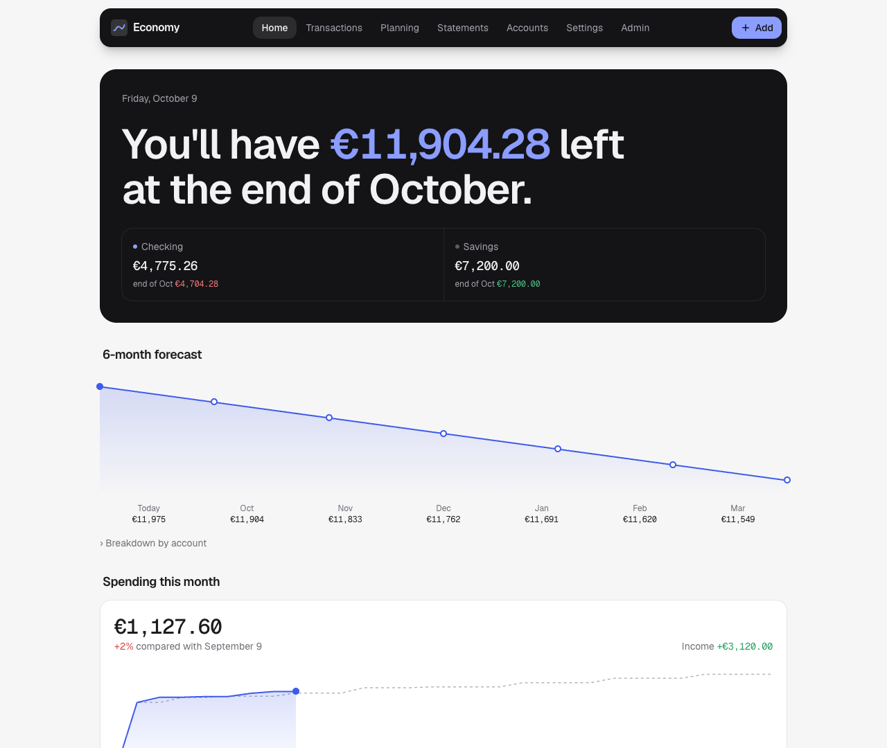
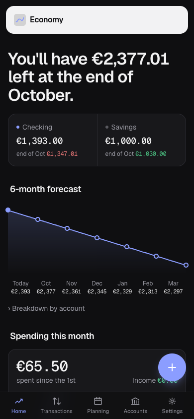
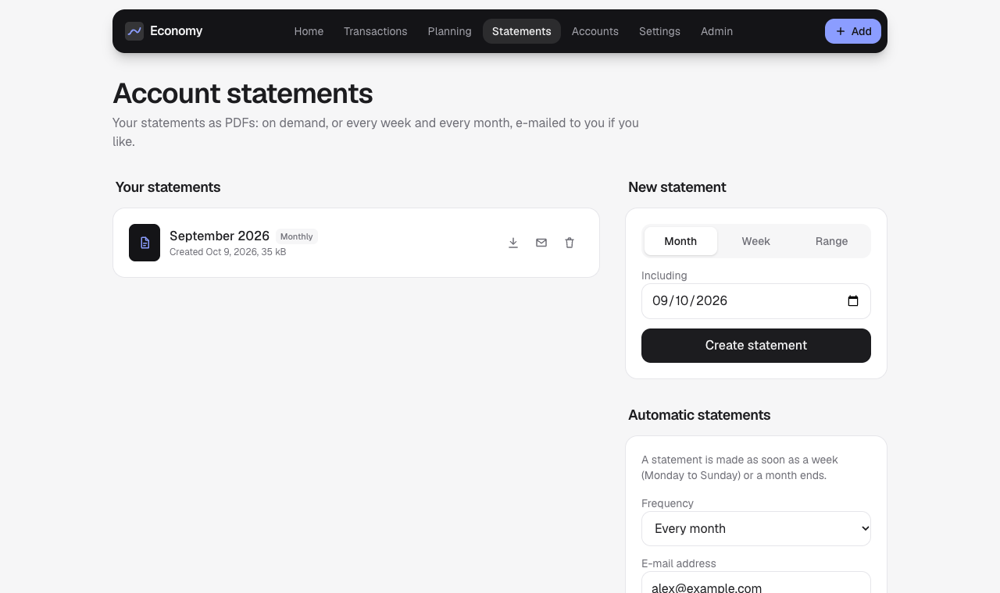
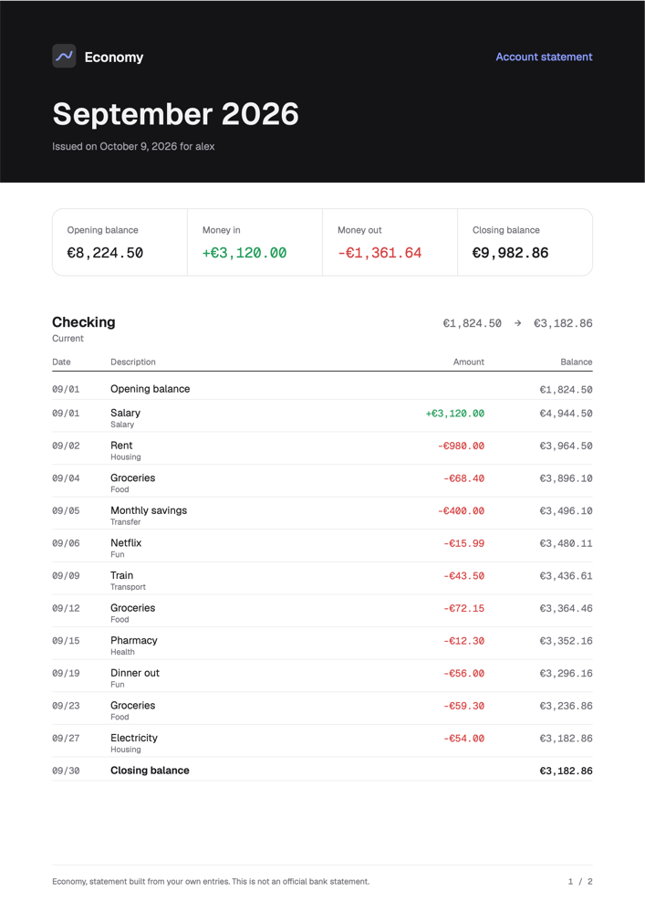

# Economy

**A self-hosted personal budget app that tells you how much you'll have left at the end of the month.**

Track your accounts, subscriptions and spending, plan one-off expenses, and see your balance six months ahead, with a warning before a savings account drops below the floor you set. It installs as an app on your phone and computer (PWA), and the data lives on your own server.

<p align="center">
  
  &nbsp;
  
</p>

## Features

**Budget**
- Current and savings accounts, each with an optional **minimum balance rule** ("my savings never go below €1,000")
- Expenses, income and transfers between accounts, with categories
- **Monthly subscriptions, salary and recurring transfers**, posted automatically on their day (missed months are caught up)
- **Planned one-off expenses**, ticked off once paid
- **End-of-month forecast** and a **6-month projection**, with an alert when a rule is about to be broken
- A month calendar of scheduled debits (tap a day to see its items) and a spending curve compared with last month

**Statements**
- **Account statements as PDFs**: opening and closing balances, money in and out, every transaction with its running balance, spending by category
- Made on demand for a month, a week or any range, or **automatically every week or month**
- **Sent by e-mail** with the PDF attached, through a mail server set up in the admin panel
- All statements in one place, ready to download, with optional **automatic cleanup** (after 3, 6, 12 or 24 months)

**Everyday use**
- Add a transaction in a few taps from anywhere, with the **+** button
- Installable **PWA** for desktop and mobile, light and dark mode
- **French and English**, per user, with the browser language as the default
- Display currency of your choice: euro by default, also US dollar, pound, Swiss franc, Canadian dollar, yen
- **Import / export**: full JSON backup (restorable), transactions as CSV for Excel or LibreOffice

**Accounts and security**
- Username and password sign-in, with **optional passkeys** (Face ID, Touch ID, Windows Hello)
- **Several users**, each with their own private data, and an **admin panel**
- No secret stored in clear text, brute-force protection, data erased for real when deleted
- One **SQLite** file through Node's built-in `node:sqlite` module, with no native dependency

## Quick start (Docker Compose)

A ready-made image is published on `ghcr.io/midnights-ra1n/economy` for **x86-64** (PCs, servers, Proxmox) and **arm64** (Raspberry Pi, Apple Silicon Macs). Docker picks the right one on its own. You only need the compose file:

```bash
mkdir economy && cd economy
curl -O https://raw.githubusercontent.com/midnights-ra1n/economy/stable/docker-compose.yml
ORIGIN=https://budget.example.com docker compose up -d
```

Open the URL and create your account: the first one is the **administrator**.

For safety, the account creation screen only stays open for **10 minutes after the container starts**. If no account is created by then, it locks, so a stranger who finds a fresh install cannot claim it. Restart the container to reopen it. Once the first account exists, nobody can sign up on their own: the administrator creates the other accounts.

> To try it locally, run `docker compose up -d` without `ORIGIN` and open http://localhost:3000.

## Other ways to run it

### `docker run`

```bash
docker run -d --name economy -p 3000:3000 \
  -e ORIGIN=https://budget.example.com \
  -v economy-data:/data \
  ghcr.io/midnights-ra1n/economy:latest
```

Always pass the same named volume (`-v economy-data:/data`). Without it, every new container starts from an empty database.

### Raspberry Pi

The same commands work on a Raspberry Pi 3, 4 or 5 running a **64-bit** system: Raspberry Pi OS 64-bit, the default on recent images, or Ubuntu. Check with `uname -m`, which must print `aarch64`. 32-bit systems are not supported, because Node.js 24 no longer ships for 32-bit ARM.

Install Docker with `curl -fsSL https://get.docker.com | sh`, then follow the quick start. Prefer an SSD to the SD card for `/data` if you can: SQLite writes often, and SD cards wear out.

### Proxmox LXC container (OCI image)

The image is a standard OCI image, and Proxmox VE 9.1 or later can create an LXC container from it.

1. Get the image into a storage's **CT Templates**, either way:
   - **Pull from OCI Registry** with the reference `ghcr.io/midnights-ra1n/economy:latest` (or a version such as `:0.1.3`);
   - or build an archive yourself and **Upload** it. `--platform` matters on Apple Silicon Macs, because Proxmox servers are x86-64:

     ```bash
     docker build --platform linux/amd64 -t economy .
     docker save economy -o economy-oci.tar      # Docker 25+ writes an OCI archive
     ```

2. Create the container (**Create CT**) from that template.
3. Prepare a host folder that belongs to the app's user. The app runs as `node` (uid 1000), which is uid 101000 on the host for an unprivileged container. Then mount it on `/data`:

   ```bash
   mkdir -p /srv/economy && chown 101000:101000 /srv/economy
   pct set <id> -mp0 /srv/economy,mp=/data
   ```

   A bind mount from the host is never deleted with the container. Avoid a Proxmox-managed volume, which is destroyed along with the container.
4. Add the environment variable `ORIGIN=https://budget.example.com` in the container options. `DATA_DIR`, `PORT` and `TZ` are already set by the image.
5. Start the container and create your account in the browser within 10 minutes (restart the container if you miss it).

   Proxmox keeps no container logs, and the **Console** tab only shows what the app prints after you open it, in **console** mode (`pct set <id> --cmode console`, then restart). The app's messages are also written to `/data/economy.log`, which you can read from the host: `cat /srv/economy/economy.log`.

To update, create a container from the new image with the same mount: it finds all the data.

### From source

To build the image yourself, add `build: .` under the `economy` service of `docker-compose.yml` and run `docker compose up -d --build` from a clone of the repository.

Without Docker, you need Node.js 24 or later and pnpm:

```bash
pnpm install
pnpm build
ORIGIN=http://localhost:3000 pnpm start
```

The database is created in `./data` (change it with `DATA_DIR`).

## Configuration

| Variable   | Default                          | Purpose                                                                 |
| ---------- | -------------------------------- | ----------------------------------------------------------------------- |
| `ORIGIN`   | `http://localhost:3000`          | Exact public URL, no trailing slash. Passkeys are bound to this domain. |
| `DATA_DIR` | `./data` (`/data` in Docker)     | Folder of the SQLite database.                                          |
| `TZ`       | `Europe/Paris` in Docker         | Time zone used for monthly due dates.                                   |
| `PORT`     | `3000`                           | HTTP port.                                                              |
| `UPDATE_CHECK` | `true`                       | Set to `false` to stop checking GitHub for new releases.                |
| `SETUP_WINDOW_MINUTES` | `10`                 | How long the first-account screen stays open after a start or a reset.  |

## Putting it online

- **HTTPS is required** for passkeys and for installing the PWA (only `localhost` is exempt). Put the app behind a reverse proxy that handles TLS. With Caddy, this is enough:

  ```
  budget.example.com {
      reverse_proxy localhost:3000
  }
  ```

- The proxy must forward the original `Host` header. Next.js server actions reject requests whose `Origin` does not match the host (CSRF protection).
- `ORIGIN` must match the URL typed in the browser exactly. If you change domains, existing passkeys stop working.
- The proxy must forward `X-Forwarded-For` (or `X-Real-IP`): sign-in attempts are rate-limited per IP address. Caddy, Traefik and nginx (with `proxy_set_header`) all do this.

## Data, updates and backups

The database is the app's only state. It lives in `/data`, outside the image, so replacing the image never touches it.

- **Docker Compose**: the named volume `economy-data` survives restarts, updates (`docker compose pull`, `docker compose up -d`) and rebuilds. Only `docker compose down -v` deletes it, so never add `-v`.
- **Schema updates**: a new version upgrades the existing database in place at startup (the version is tracked in `PRAGMA user_version`), keeping all data. For example, a single-user install became multi-user, and its owner became the administrator.
- **Logs**: the app's messages (start, version, account creation deadline, warnings) go to the container output and to `/data/economy.log` (rotated at 1 MB).
- **Check**: every start logs `[economy] Database /data/economy.db: N user(s).`, with a warning if `/data` is not a mounted volume. The admin panel also shows **Storage: Persistent** or **Ephemeral**.
- **Backups**: **Settings → Export a backup (JSON)** for your own data, or copy the whole database: `sqlite3 /data/economy.db ".backup economy-backup.db"`. Export before a major update.

## Versions and updates

Every push to the `stable` branch, whether a direct push or a merged `dev` → `stable` pull request, runs [the release workflow](.github/workflows/release.yml):

1. lint, type check and unit tests;
2. the next version is computed: the last release's patch number + 1 (`0.1.3` → `0.1.4`). To start a new minor or major version, set it in `package.json` (for example `0.2.0`) and the following releases count up from there;
3. the image is built and published as `ghcr.io/midnights-ra1n/economy:latest`, `:<version>` and `:sha-<commit>`;
4. a GitHub release `v<version>` is created, with notes generated from the commits.

Pull requests to `stable` run the tests and a test build, without publishing anything.

The app shows its version in **Settings** and in the admin panel. Every 6 hours it checks the latest GitHub release; when a newer one exists, administrators see a banner with a link to its notes. There is no update button: updates come with the image.

```bash
docker compose pull && docker compose up -d      # or let an image auto-updater do it
```

On Proxmox, pull the new image and recreate the container with the same `/data` mount. To stay on a given version, use a version tag instead of `latest`.

## Statements

**Statements** in the menu lists every statement, to open or download as a PDF, or to send by e-mail.

<p align="center">
  
  &nbsp;
  
</p>

- **New statement**: a month or a week (Monday to Sunday) from any day in it, or any range of up to a year. Making a month or week again replaces it with fresh figures.
- **Automatic statements**: every week or every month, a statement is made once the period is over, checked every hour. With an e-mail address and the box ticked, it is also e-mailed with the PDF attached; a failed send is retried at the next check.
- **Automatic cleanup** deletes statements older than the chosen number of months.
- A statement is a snapshot: editing transactions later does not change it. Erasing your banking data deletes your statements too.

### Setting up e-mail

1. An administrator enters the outgoing mail server in **Admin → E-mail**: SMTP server, port and security (STARTTLS on 587, or TLS on 465), username and password, and the sender, for example `no-reply@example.com` with the name `Economy`.
2. Each user enters their own address in **Settings → E-mail address**: their statements go there.
3. **Send a test e-mail**, in the admin panel or in Settings, sends a sample statement with its PDF attached. Receiving it confirms that both sending and PDF generation work.

The SMTP password is encrypted (AES-256-GCM) with a key stored outside the database, in `/data/secret.key`. A copy of `economy.db` alone does not reveal it, and it is never sent back to the browser. Keep `secret.key` with the database when you move it; otherwise, enter the password again.

## Users and administration

- Each user sees only their own accounts, transactions and plans, and their exports contain only their data.
- The administrator reaches the panel from **Admin** (top bar on desktop, or **Settings → Administration** on mobile). It shows instance statistics, and for each user lets you:
  - change their role
  - set a new password, which signs them out everywhere
  - sign them out of all their devices
  - **erase their banking data** while keeping their login
  - delete them
- An administrator can neither demote nor delete themselves, so there is always at least one administrator.
- **Reset the app**, at the bottom of the admin panel, deletes every user and all data. It asks you to type `RESET` (or `RÉINITIALISER`) and your password, then opens the first-account screen again for 10 minutes.
- Every user can also erase their own banking data from **Settings**, with their password.

## Languages

The interface is available in **French and English**. Each user picks a language in **Settings → Language and currency**. Before signing in, the app follows the browser language, and the login page has a language switch.

Strings live in [`lib/i18n.ts`](lib/i18n.ts). To add a language, add a dictionary there with the same keys (TypeScript flags any missing one) and register it in `LOCALES`.

## Security

- No secret is readable in the database. Passwords are hashed with salted **scrypt**, session tokens with SHA-256.
- The database is never served over the web. Its folder is `700` and its files `600`, so only the app's system user can read them.
- The first account can only be created during the first 10 minutes after the server starts (or after a reset). Creating it is serialized, so two simultaneous attempts cannot both become administrator.
- After 5 failed sign-ins, an IP address is locked out for 15 minutes.
- Sessions are random tokens in an `HttpOnly`, `SameSite=Lax` cookie (`Secure` over HTTPS) and expire after 30 days. Changing a password signs out the other devices.
- WebAuthn challenges are stored server-side, single-use, and expire after 5 minutes.
- Every page and server action checks the session again, and admin actions check the role again. Every query on banking data is filtered by user, and account ids sent by forms are verified.
- Deleted data is overwritten (`PRAGMA secure_delete`). A full reset also empties the WAL journal and compacts the database.
- The SMTP password is the only secret the app must read back: it is encrypted with a key kept outside the database (`/data/secret.key`, mode 600) and never shown again in the interface.
- Security headers are set (HSTS, `X-Frame-Options`, `nosniff`, …), and the app asks search engines not to index it.

## Development

```bash
pnpm dev      # http://localhost:3000
pnpm test     # unit tests: forecast, backup format, migrations, translations
pnpm lint
pnpm typecheck
```

Built with Next.js 16 (App Router, server actions), React 19, Tailwind CSS 4, `node:sqlite` and `@simplewebauthn`. Fonts: Geist and Geist Mono.

```
app/(app)/     signed-in pages: dashboard, transactions, planning, statements, accounts, settings, admin
app/login/     setup, sign-in and passkeys
lib/db.ts      SQLite connection, schema migrations, first-account window, logs
lib/auth.ts    sessions, passwords, rate limiting
lib/budget.ts  per-user budget queries
lib/forecast.ts  projection logic (pure, tested)
lib/i18n.ts    French and English strings
lib/statement.ts  statement periods and figures (pure, tested)
lib/pdf.ts     PDF statement (pdfkit, Geist fonts from assets/fonts)
lib/mail.ts    statement e-mail (nodemailer)
lib/reports.ts storage, scheduler, e-mail and cleanup of statements
```
